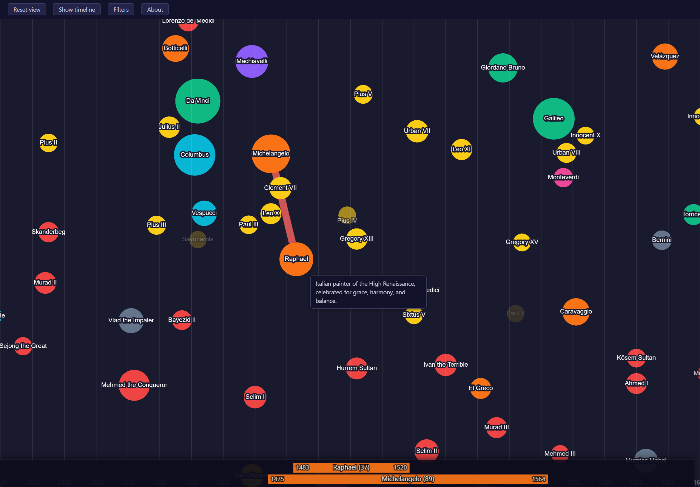

# Human History Graph

An interactive, browser-based graph of historical figures spanning antiquity to ~1900. Each person is a node placed by **birth year** (x-axis) and **geographic region** (y-axis); edges show relationships between them (teacher/student, rival, collaborator, patron, family, influence, and more). Node size reflects historical prominence (HPI score from the Pantheon dataset).

Built with [Cytoscape.js](https://js.cytoscape.org/). No backend, no build step, no framework: just static HTML, CSS, and an ES-module `app.js` reading JSON data files.

**Live at: https://jparimaa.github.io/human-history-graph/**



## Features

- **Birth-year timeline** with an adaptive year grid that re-labels itself as you zoom (BC/AD aware).
- **Progressive reveal**: the number of visible people grows as you zoom in. Ranking is viewport-aware, so the most prominent figures in the part of history you are looking at always show, and sparse eras never appear empty.
- **Relationships on demand**: hover (or tap on touch) a person to reveal their connections, colour-coded by relationship family.
- **Info panel** with a longer description, why the person matters, and a list of their connections.
- **Lifespan bar**: birth-to-death bars for the selected person and their neighbours, aligned to the timeline.
- **Occupation filter**: toggle which occupation groups (each with its own colour) are shown, or show everyone at once.
- **Era/timeline ruler**: a toggleable bar of historical eras and point events.
- **Smooth cursor-anchored wheel zoom** tuned to behave consistently across mice and trackpads, with pinch-to-zoom on touch.
- **Touch layout**: on phones the toolbar sits at the top, the timeline/edges/lifespan bar are dropped, and tapping a person opens a peek-then-expand bottom sheet (short description, then full bio and connections).

## Running locally

The page fetches JSON over HTTP, so it must be served (opening `index.html` via `file://` will not work):

```
python -m http.server 8000
```

Then open http://localhost:8000.

## Project layout

```
index.html          single-page shell
app.js              all application logic (ES module)
style.css           dark theme
data/               git submodule (historical-figure-data): people, descriptions, relations
settings/           local config: eras, regions, occupation groups (JSON)
test/               opt-in Playwright behaviour checks (inspect.mjs)
```

For data schemas, layout formulas, and the exact behaviour of the visibility/zoom logic, see `CLAUDE.md`.